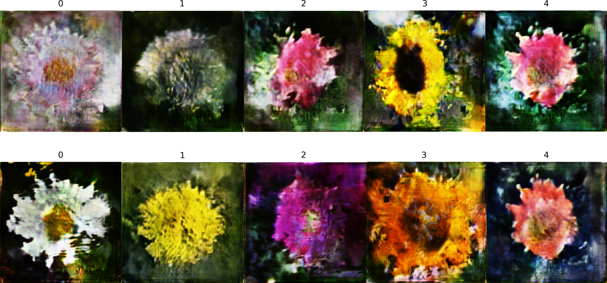
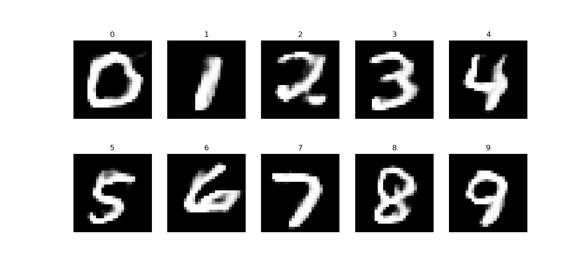
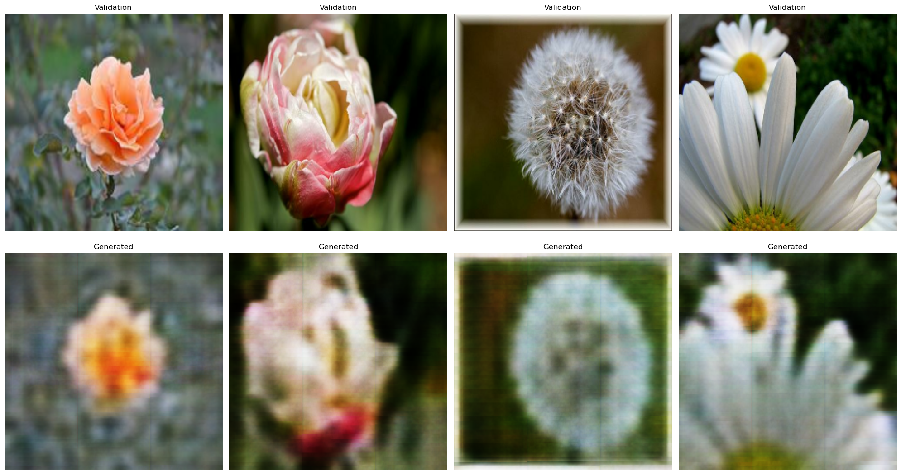

## Пытаюсь сделать нейронку для генерации цветочков 🌸🌷💐

- CAE, CGAN, CVCAE — нейронки для генерации цветочков. Написаны на keras в Jupyter
- gcae_mnist — такой же генеративный автоэнкодер, но для генерации изображений mnist (генерирует плохо, но сжимает хорошо)
- cvcae_mnist — тоже генаратор цифр mnist, но более закавыристый (см. схему ниже) 
- cgan_mnist — ~~пизженный~~ взятый из интернетов CCGAN (расширенный свёрточный GAN)
- increasing_data — прога для расширения датасета каритнок

####  

### Примерная схема эволюции моего ~~покемона~~ автоэнкодера:
- ### ~~Автоэнкодер (AutoEncoder | AE)~~
- при помощи Dense сжимает и расжимает изображение

- ### ~~Свёрточный Автоэнкодер (Convolutional AutoEncoder | CAE)~~
- в место Dense используем свёртки (Conv2D) и развёртки (Conv2DTranspose)

- ### ~~Генеративный Свёрточный Автоэнкодер (Generative Convolutional AutoEncoder | GCAE)~~
- энкодер и декодер разделены, можно подать шум на вход декодера и получить картинку

- ### ~~Вариационный Свёрточный Автоэнкодер (Variational Convolutional AutoEncoder | VCAE)~~  
- контролируем скрытое пространство, чтобы оно приближалось к нормальному распределению

- ### ~~Расширенный Вариационный Свёрточный Автоэнкодер (Conditional Variational Convolutional AutoEncoder | CVCAE)~~
- в энкодер и декодер дополнительно подаём ещё и лейблы (aka метки класса (что у нас вообще изображено на картинке))

- ### ~~Генеративно-Состязательная Нейронка (Generative Adversarial Networks | GAN)~~ 
- две нейронки в одной: одна генерирует, другая определяет — фейк это или настоящая фотография

- ### ~~Расширенная Свёрточная Генеративно-Состязательная Нейронка (Conditional Convolutional Generative Adversarial Networks | CCGAN)~~ _(сейчас думаю над этим)_
- подаём в GAN ещё и лейблы (метки класса)

- ### Расширенная Свёрточная Генеративно-Состязательная Нейронка с Расширенным Вариационным Свёрточным Автоэнкодером (CCGAN + CVCAE)
- зачем?

##  

Пример картинок:

(это просто автоэнкодер, он почти не генерирет, а только восстанавливает)
